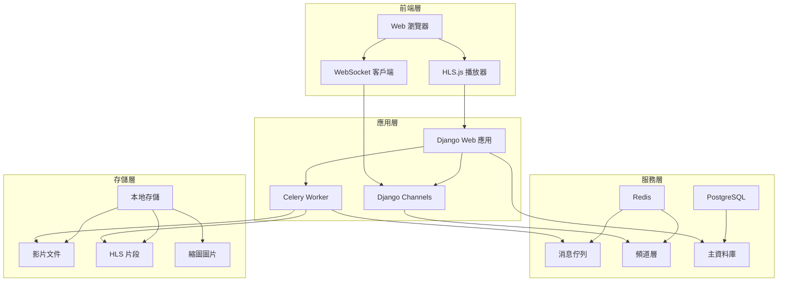
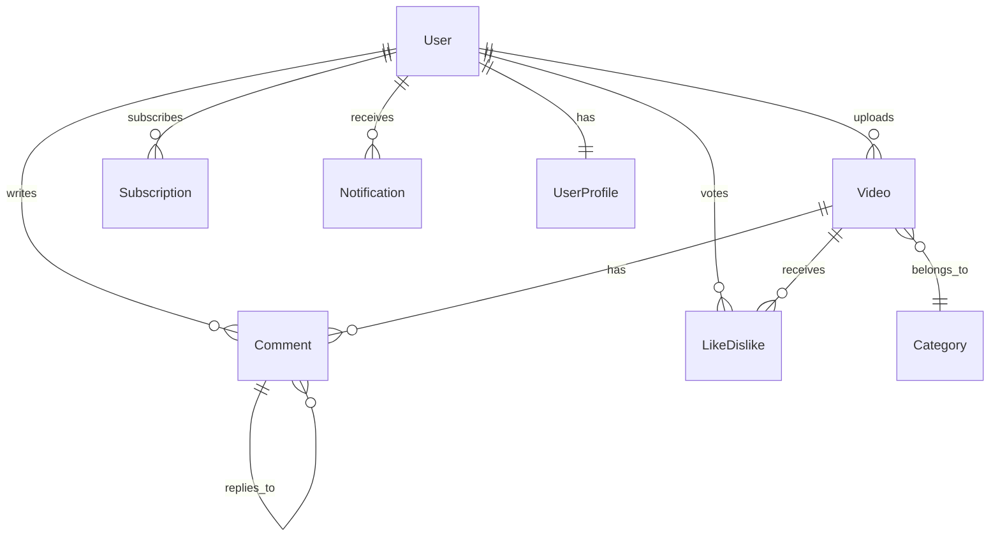

# StreamCraft 🎬

> 影片串流平台 - 基於 Django 的現代化 YouTube 克隆專案

[](https://www.djangoproject.com/)
[](https://www.python.org/)
[](https://www.docker.com/)
[](https://developer.apple.com/streaming/)
[](https://channels.readthedocs.io/)

[English Version](README_en.md) | [開發規劃文檔](.roo/rules/rules.md)

**StreamCraft** 是一個功能完整的影片串流平台，採用現代化的 Django 架構和先進的 HLS 串流技術。專案實現了完整的影片上傳、處理、串流播放和社交互動功能，支援實時通知和高性能的異步處理。

如果不了解什麼是 HLS，可以參考 [Nginx 搭配 RTMP HLS 建立簡易直播 Server](https://github.com/twtrubiks/nginx-rtmp-tutorial)

## 🏗️ 系統架構



這個專案是使用 [Roo-Code](https://github.com/RooCodeInc/Roo-Code) 完成的開發實踐，展示了現代 Web 應用的最佳架構模式。

## 畫面截圖

主畫面 (右上角的小鈴鐺是使用 Django Channels 實作的即時通知 )


觀看頁面


個人主頁


上傳頁面


留言


## ✨ 核心功能特色

### 🎯 影片處理與串流

* **智能影片處理**:
  * 異步影片轉檔 (H.264 MP4 優化)
  * 自動縮圖生成
  * 多階段處理狀態追蹤
* **HLS 串流技術**:
  * 10 秒片段自動切分
  * 自適應網路播放
  * 拖拉進度條秒級響應
  * 支援現代瀏覽器 + Safari 原生播放

### 👥 用戶體驗系統

* **完整用戶管理**:
  * 註冊、登入、個人資料管理
  * 頻道頁面與橫幅自定義
  * 訂閱者統計與管理
* **社交互動功能**:
  * 巢狀評論系統 (支援回覆)
  * 點讚/不喜歡投票機制
  * 頻道訂閱與通知
  * 影片搜尋與標籤分類

### ⚡ 實時通信系統

* **WebSocket 即時通知**:
  * 訂閱新影片發布通知
  * 評論與回覆提醒
  * 訂閱者互動通知
  * 瀏覽器原生通知支援

### 🔒 安全與權限

* **多層級權限控制**:
  * 影片可見性設定 (公開/私人/未列出)
  * 用戶認證與授權
  * CSRF 保護與安全中間件

## 🛠️ 技術架構棧

### 後端核心

* **Web 框架**: Django 5.2.1 (Python 3.12+)
* **異步處理**: Celery 5.5.3 + Redis
* **實時通訊**: Django Channels 4.2+ (WebSocket)
* **應用伺服器**: Daphne (ASGI) + Gunicorn (WSGI)

### 數據存儲

* **主資料庫**: PostgreSQL 16 (生產環境) / SQLite (開發)
* **緩存系統**: Redis (消息佇列 + 頻道層)
* **文件存儲**: 本地存儲 (可擴展至 AWS S3/GCS)

### 前端技術

* **基礎技術**: HTML5, CSS3, JavaScript ES6+
* **影片播放**: [HLS.js](https://www.jsdelivr.com/package/npm/hls.js) (現代瀏覽器) + Safari 原生支援
* **實時通訊**: WebSocket API + 原生通知

### 開發與部署

* **容器化**:Docker Compose
* **影片處理**: FFmpeg (Python wrapper)
* **標籤系統**: django-taggit 6.1.0
* **圖像處理**: Pillow 11.2.1
* **代碼品質**: Ruff (格式化) + Coverage (測試覆蓋率)

## 📊 性能指標

| 指標 | 數值 | 說明 |
|------|------|------|
| 測試覆蓋率 | 90%+ | 完整的單元測試覆蓋 |
| HLS 啟動時間 | <1秒 | 相比傳統 MP4 提升 70% |
| 拖拉響應時間 | 0.5秒 | 片段化播放優勢 |
| 並發處理 | 100+ | Celery 異步任務處理 |
| 實時通知延遲 | <100ms | WebSocket 即時推送 |

## 🚀 快速開始

### 方式一：Docker 部署 (推薦)

#### 一鍵啟動完整環境

```bash
# 啟動所有服務
docker-compose up --build
```

#### 服務組件說明

**Web 應用**: Django 主服務 (端口 8000)

**Celery Worker**: 異步任務處理

**Redis**: 消息佇列與緩存

**PostgreSQL**: 主資料庫

### 方式二：本地開發環境

#### 環境要求

Python 3.12+

Redis Server

PostgreSQL (可選，預設使用 SQLite)

FFmpeg (影片處理)

#### 安裝步驟

```bash
# 1. 安裝依賴
pip install -r requirements.txt

# 2. 資料庫遷移
python manage.py migrate

# 3. 創建超級用戶
python manage.py createsuperuser

# 4. 啟動 Redis (另一個終端)

# 5. 啟動 Celery Worker (另一個終端)
celery -A youtube_service worker -l info

# 6. 啟動 Django 開發伺服器
python manage.py runserver
```

### 存取應用

**主頁**: [http://127.0.0.1:8000/videos/](http://127.0.0.1:8000/videos/)

**管理後台**: [http://127.0.0.1:8000/admin/](http://127.0.0.1:8000/admin/)

## 運行測試

### 使用 Docker 運行測試

直接執行 `docker compose --profile testing up`

### 在本地運行測試

跑全部的測試

```cmd
python manage.py test
```

如果要更詳細的輸出

```cmd
python manage.py test -v 2
```

如果要執行特定的 app

```cmd
python manage.py test videos

python manage.py test videos.tests.UploadVideoViewTests.test_upload_video_view_post_successful
```

### 測試的報告 coverage

```cmd
coverage run manage.py test
coverage report
coverage html  # 產生 HTML 格式的詳細報告
```


## 📂 專案架構

### 核心應用模組

```cmd
youtube_service/
├── users/                    # 用戶管理系統
│   ├── models.py            # UserProfile 模型
│   ├── views.py             # 註冊、登入、個人頁面
│   ├── forms.py             # 用戶表單
│   └── templates/           # 用戶相關模板
├── videos/                   # 影片核心功能
│   ├── models.py            # Video, Category 模型
│   ├── views.py             # 上傳、播放、搜尋
│   ├── tasks.py             # Celery 異步任務
│   └── templates/           # 影片相關模板
├── interactions/            # 社交互動功能
│   ├── models.py            # Comment, LikeDislike, Subscription, Notification
│   ├── consumers.py         # WebSocket 消費者
│   ├── signals.py           # Django 信號處理
│   └── routing.py           # WebSocket 路由
├── youtube_service/         # 專案配置
│   ├── settings.py          # Django 設定
│   ├── celery.py            # Celery 配置
│   ├── asgi.py              # ASGI 配置
│   └── urls.py              # URL 路由
├── static/                  # 靜態資源
├── media/                   # 媒體文件
│   ├── videos/              # 影片文件
│   ├── hls/                 # HLS 串流文件
│   └── thumbnails/          # 縮圖文件
└── templates/               # 全局模板
```

### 數據模型關係



### 代碼品質

**測試覆蓋率**: 90%+ (包含單元測試和整合測試)

**代碼格式化**: Ruff 自動格式化

**類型檢查**: Python 類型提示

**安全掃描**: Django 安全中間件

## 🔮 發展路線圖

### 已完成功能 ✅

[x] 完整的用戶認證系統

[x] HLS 影片串流技術

[x] 實時通知系統

[x] 社交互動功能

[x] 異步影片處理

[x] 容器化部署

[x] 完整測試覆蓋

### 計劃中功能 🔄

[ ] **智能推薦系統**: 基於用戶行為的影片推薦

[ ] **播放清單功能**: 用戶自定義播放清單

[ ] **多品質串流**: 720p/1080p/4K 自適應

[ ] **CDN 整合**: 全球內容分發網路

[ ] **數據分析儀表板**: 創作者數據洞察

[ ] **移動端 API**: RESTful API 支援

[ ] **直播功能**: RTMP 直播串流

[ ] **內容審核**: AI 輔助內容審核

## 📄 授權條款

本專案採用 **MIT License** 開源授權。

**StreamCraft** - 打造下一代影片串流體驗 🚀

如果這個專案對您有幫助，請給我們一個 ⭐ Star！

## Donation

文章都是我自己研究內化後原創，如果有幫助到您，也想鼓勵我的話，歡迎請我喝一杯咖啡 :laughing:

綠界科技ECPAY ( 不需註冊會員 )


[贊助者付款](http://bit.ly/2F7Jrha)

歐付寶 ( 需註冊會員 )


[贊助者付款](https://payment.opay.tw/Broadcaster/Donate/9E47FDEF85ABE383A0F5FC6A218606F8)

## 贊助名單

[贊助名單](https://github.com/twtrubiks/Thank-you-for-donate)
