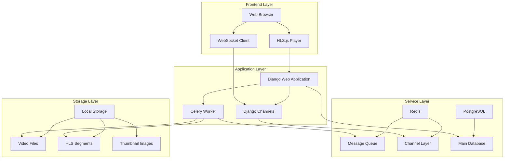
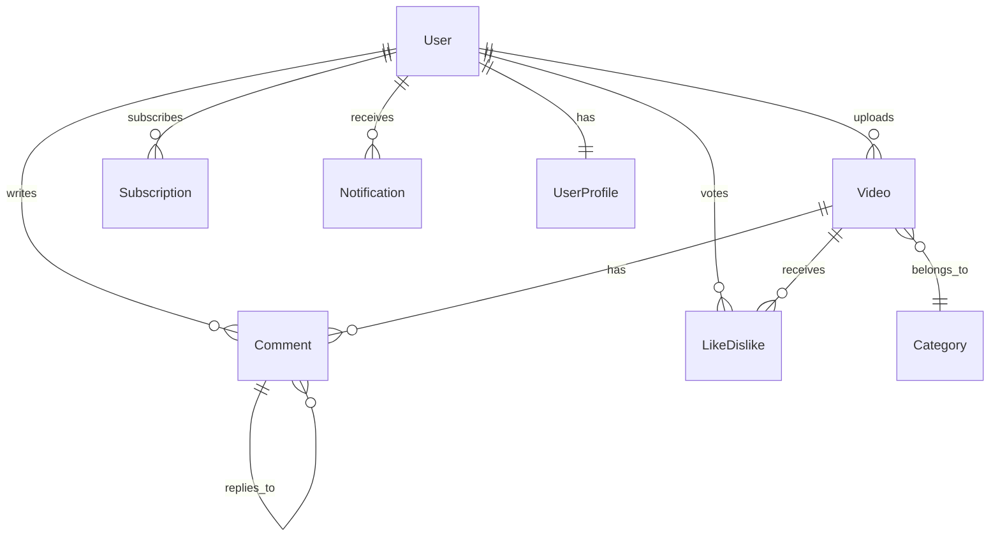

# StreamCraft 🎬

> Video Streaming Platform - A Modern YouTube Clone Project Based on Django

[](https://www.djangoproject.com/)
[](https://www.python.org/)
[](https://www.docker.com/)
[](https://developer.apple.com/streaming/)
[](https://channels.readthedocs.io/)

[中文版](README.md) | [Development Planning Document](.roo/rules/rules.md)

**StreamCraft** is a full-featured video streaming platform built with a modern Django architecture and advanced HLS streaming technology. The project implements complete video upload, processing, streaming, and social interaction functionalities, supporting real-time notifications and high-performance asynchronous processing.

If you are unfamiliar with HLS, you can refer to [Setting up a simple live streaming server with Nginx, RTMP, and HLS](https://github.com/twtrubiks/nginx-rtmp-tutorial).

## 🏗️ System Architecture



This project was developed as a practical implementation using [Roo-Code](https://github.com/RooCodeInc/Roo-Code), demonstrating the best architectural patterns for modern web applications.

## Screenshots

Main Page (The little bell in the top right corner is a real-time notification feature implemented using Django Channels)


Watch Page


Profile Page


Upload Page


Comments


## ✨ Core Features

### 🎯 Video Processing & Streaming

* **Intelligent Video Processing**:
  * Asynchronous video transcoding (H.264 MP4 optimized)
  * Automatic thumbnail generation
  * Multi-stage processing status tracking
* **HLS Streaming Technology**:
  * Automatic 10-second segment splitting
  * Adaptive bitrate streaming
  * Second-level response for progress bar seeking
  * Native playback support in modern browsers + Safari

### 👥 User Experience System

* **Complete User Management**:
  * Registration, login, profile management
  * Customizable channel pages and banners
  * Subscriber statistics and management
* **Social Interaction Features**:
  * Nested comment system (with reply support)
  * Like/dislike voting mechanism
  * Channel subscriptions and notifications
  * Video search and tag-based categorization

### ⚡ Real-time Communication System

* **WebSocket Real-time Notifications**:
  * Notifications for new video uploads from subscriptions
  * Comment and reply alerts
  * Subscriber interaction notifications
  * Native browser notification support

### 🔒 Security & Permissions

* **Multi-level Permission Control**:
  * Video visibility settings (Public/Private/Unlisted)
  * User authentication and authorization
  * CSRF protection and security middleware

## 🛠️ Technology Stack

### Backend Core

* **Web Framework**: Django 5.2.1 (Python 3.12+)
* **Asynchronous Processing**: Celery 5.5.3 + Redis
* **Real-time Communication**: Django Channels 4.2+ (WebSocket)
* **Application Server**: Daphne (ASGI) + Gunicorn (WSGI)

### Data Storage

* **Main Database**: PostgreSQL 16 (Production) / SQLite (Development)
* **Caching System**: Redis (Message Queue + Channel Layer)
* **File Storage**: Local Storage (extendable to AWS S3/GCS)

### Frontend Technology

* **Base Technologies**: HTML5, CSS3, JavaScript ES6+
* **Video Playback**: [HLS.js](https://www.jsdelivr.com/package/npm/hls.js) (Modern Browsers) + Native Safari Support
* **Real-time Communication**: WebSocket API + Native Notifications

### Development & Deployment

* **Containerization**: Docker Compose
* **Video Processing**: FFmpeg (Python wrapper)
* **Tagging System**: django-taggit 6.1.0
* **Image Processing**: Pillow 11.2.1
* **Code Quality**: Ruff (Formatter) + Coverage (Test Coverage)

## 📊 Performance Metrics

| Metric                | Value | Description                               |
| --------------------- | ----- | ----------------------------------------- |
| Test Coverage         | 90%+  | Complete unit and integration test coverage |
| HLS Startup Time      | \<1s   | 70% improvement over traditional MP4      |
| Seeking Response Time | 0.5s  | Advantage of segmented playback           |
| Concurrent Processing | 100+  | Handled by Celery asynchronous tasks      |
| Real-time Notification Latency | \<100ms | Instant push via WebSocket                |

## 🚀 Quick Start

### Method 1: Docker Deployment (Recommended)

#### One-click Startup for the Complete Environment

```bash
# Start all services
docker-compose up --build
```

#### Service Components Description

**Web Application**: Main Django service (port 8000)

**Celery Worker**: Asynchronous task processing

**Redis**: Message queue and cache

**PostgreSQL**: Main database

### Method 2: Local Development Environment

#### Requirements

* Python 3.12+
* Redis Server
* PostgreSQL (optional, defaults to SQLite)
* FFmpeg (for video processing)

#### Installation Steps

```bash
# 1. Install dependencies
pip install -r requirements.txt

# 2. Database migrations
python manage.py migrate

# 3. Create a superuser
python manage.py createsuperuser

# 4. Start Redis (in another terminal)

# 5. Start Celery Worker (in another terminal)
celery -A youtube_service worker -l info

# 6. Start Django development server
python manage.py runserver
```

### Accessing the Application

**Main Page**: [http://127.0.0.1:8000/videos/](http://127.0.0.1:8000/videos/)

**Admin Backend**: [http://127.0.0.1:8000/admin/](http://127.0.0.1:8000/admin/)

## Running Tests

### Running Tests with Docker

Execute `docker compose --profile testing up` directly.

### Running Tests Locally

Run all tests:

```cmd
python manage.py test
```

For more detailed output:

```cmd
python manage.py test -v 2
```

To run tests for a specific app:

```cmd
python manage.py test videos

python manage.py test videos.tests.UploadVideoViewTests.test_upload_video_view_post_successful
```

### Test Coverage Report

```cmd
coverage run manage.py test
coverage report
coverage html  # Generate a detailed report in HTML format
```


## 📂 Project Architecture

### Core Application Modules

```cmd
youtube_service/
├── users/                    # User management system
│   ├── models.py            # UserProfile model
│   ├── views.py             # Registration, login, profile page
│   ├── forms.py             # User forms
│   └── templates/           # User-related templates
├── videos/                   # Core video features
│   ├── models.py            # Video, Category models
│   ├── views.py             # Upload, watch, search
│   ├── tasks.py             # Celery asynchronous tasks
│   └── templates/           # Video-related templates
├── interactions/            # Social interaction features
│   ├── models.py            # Comment, LikeDislike, Subscription, Notification
│   ├── consumers.py         # WebSocket consumers
│   ├── signals.py           # Django signal handling
│   └── routing.py           # WebSocket routing
├── youtube_service/         # Project configuration
│   ├── settings.py          # Django settings
│   ├── celery.py            # Celery configuration
│   ├── asgi.py              # ASGI configuration
│   └── urls.py              # URL routing
├── static/                  # Static assets
├── media/                   # Media files
│   ├── videos/              # Video files
│   ├── hls/                 # HLS streaming files
│   └── thumbnails/          # Thumbnail files
└── templates/               # Global templates
```

### Data Model Relationships



### Code Quality

**Test Coverage**: 90%+ (including unit and integration tests)

**Code Formatting**: Automated with Ruff

**Type Checking**: Python type hints

**Security Scanning**: Django security middleware

## 🔮 Development Roadmap

### Completed Features ✅

[x] Complete user authentication system

[x]  HLS video streaming technology

[x]  Real-time notification system

[x]  Social interaction features

[x]  Asynchronous video processing

[x]  Containerized deployment

[x]  Full test coverage

### Planned Features 🔄

[ ] **Intelligent Recommendation System**: Video recommendations based on user behavior

[ ] **Playlist Functionality**: User-defined playlists

[ ] **Multi-quality Streaming**: Adaptive 720p/1080p/4K

[ ] **CDN Integration**: Global Content Delivery Network

[ ] **Data Analytics Dashboard**: Creator data insights

[ ] **Mobile API**: Support via RESTful API

[ ] **Live Streaming Functionality**: RTMP live streaming

[ ] **Content Moderation**: AI-assisted content review

## 📄 License

This project is licensed under the **MIT License**.

**StreamCraft** - Building the next generation of video streaming experiences 🚀

If this project helps you, please give us a ⭐ Star\!

## Donation

All articles are original, researched, and internalized by me. If this has been helpful to you and you'd like to encourage me, please feel free to buy me a cup of coffee :laughing:

ECPAY (No membership required)


[Sponsor Payment](http://bit.ly/2F7Jrha)

O'Pay (Membership required)


[Sponsor Payment](https://payment.opay.tw/Broadcaster/Donate/9E47FDEF85ABE383A0F5FC6A218606F8)

## List of Sponsors

[List of Sponsors](https://github.com/twtrubiks/Thank-you-for-donate)